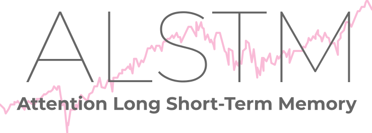

 

  

  
  
  
  

 

$${\color[rgb]{0.38,0,0.13}\text{\Large Previsão do Índice S\&P 500 Utilizando LSTM e Mecanismos de Atenção}}$$

Aplicação web do projeto desenvolvido como <b>Trabalho de Conclusão de Curso</b> durante o último ano de graduação em <b>Engenharia Mecatrônica</b> na Escola Politécnica da Universidade de São Paulo (EP-USP)

## 📜 Sobre

Repositório complementar, dedicado à hospedagem da aplicação web frontend desenvolvida para facilitar o acesso e a utilização do modelo preditivo por usuários não necessariamente familiarizados com programação.

> [!IMPORTANT]
> 🧠 **[Visite o repositório principal](https://github.com/gvmossato/alstm-stock-market)**

## 🌎 Aplicação

Com os dados hospedados no IBM Cloudant (banco NoSQL), o deploy da interface foi no GitHub Pages, sendo essa desenhada para fornecer da maneira mais direta possível as recomendações da rede.

Assim, um usuário poderia verificar todo o histórico de previsões do modelo e compará-las com o índice de fato. Além disso, ainda contava com a recomendação de compra ou venda segundo o modelo naquele momento, tendo em vista a previsão da rede para o preço de fechamento do dia seguinte.

Do ponto de vista operacional, a rede era executada automaticamente uma vez por dia próximo ao horário de fechamento do mercado para que um investidor pudesse ter a previsão mais fidedigna possível, mas ainda possuindo tempo hábil para operar.

Como o modelo foi treinado inicialmente com dados disponíveis até a data limite de 18/08/2021, afim de permitir conjuntos de validação e teste, iniciou-se com o deploy da aplicação um processo de treinamentos incrementais.

Assim, como dito, diariamente o modelo realizava predições com os dados mais atuais disponíveis, mas antes, uma vez que constatasse que o último treinamento havia ocorrido há pelo menos um semestre atrás (aproximadamente o batch size em dias úteis), automaticamente executava a rotina de treinamento incremental.

Essa metodologia permitiu ao modelo incorporar sempre novas tendências de mercado e não ficar apenas enviesado nos padrões observados antigamente. Até ser retirado do ar, o modelo passou por 5 treinamentos incrementais, cada um com 15 epochs.

Aqui está a tabela em Markdown conforme solicitado:

| \# | Evento                                                      | Data          |
|----|-------------------------------------------------------------|---------------|
| 1  | Deploy do modelo (conhecimento até 18/08/2021)              | 23/11/2023    |
| 2  | Novo treinamento incremental (apenas com dados adicionais)  | 22/02/2022    |
| 3  | Novo treinamento incremental (apenas com dados adicionais)  | 23/08/2022    |
| 4  | Novo treinamento incremental (apenas com dados adicionais)  | 27/02/2023    |
| 5  | Novo treinamento incremental (apenas com dados adicionais)  | 28/08/2023    |
| 6  | Novo treinamento incremental (apenas com dados adicionais)  | 29/02/2024    |
| 7  | Desligamento do modelo                                      | 16/04/2024    |
